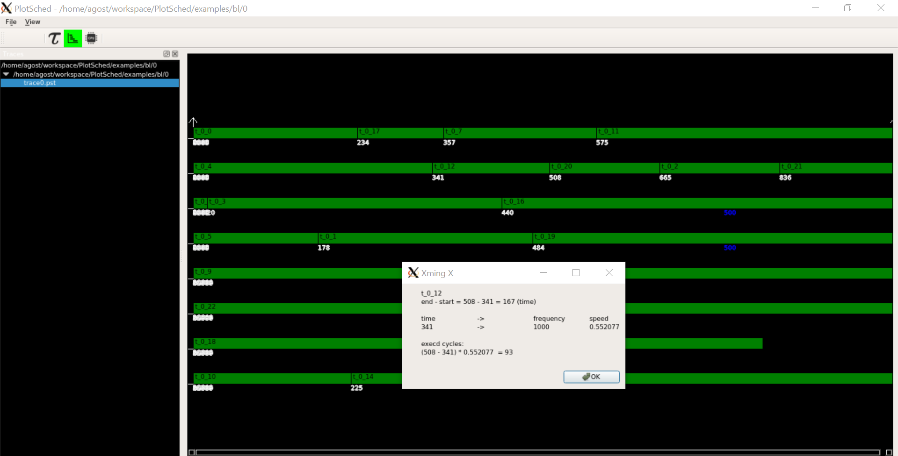

# PlotSched

Scheduling traces plotter

* Initial development, November 2015
* Different views (Gannt and from tasks viewpoint) - January 2020 - now



----
## Authors

* Alessio Balsini (a.balsini@sssup.it) - original author

	https://github.com/balsini/PlotSched
* Agostino Mascitti (a.mascitti@santannapisa.it)

License: GPL 2.0

----
## Introduction

PlotSched is a flexible tool for graphically showing (general) events stored in a file.

It was born by the need of having a flexible and straightforward tool for quickly showing the scheduler behavior.

----

## Instructions

In the following sections are presented the steps required for compiling the tool and the instructions for running it.

### Dependencies

This tool requires the Qt5 SDK.

### Compiling

Being a Qt5 project, it is required to generate the makefile.
Enter into directory `src/` and type:

```
cd src/
qmake PlotSched.pro
```

This produces the makefile file `Makefile`, that can be directly used for compiling:

```
make
```

Now, the executable `PlotSched` is generated and can be run:

```
./PlotSched
```

Select the icons folder in the menu above and select the folder `PlotSched/examples/bl/0/`.
Then, select the only .pst file available. You should get the screenshot above.

### In your code

main.cpp

```
PSTrace  pstrace("trace.pst");

PeriodicTask* t = new PeriodicTask(200, 200, 0, task_name);
t->insertCode("fixed(10,bzip2)");
pstrace.attachToTask(*t);

...
SIMUL.run(400);
```

where PeriodicTask and PSTrace are classes of RTSim.

### Some notes
This version has been expecially thought for ARM big-LITTLE,
an architecture in which cores can change frequency. Thus,
also tasks WCETs change. In the future, I will try to
also support architecture where frequencies are kept maximized.

### Usage

The file extension is `.pst` (Plot Sched Trace).

The file format used by `PlotSched` is the following:

```
<time> <entity> <CPU> <event name> <event status>
```

Where:
* `time` is the time at which the event is generated;
* `entity` is the subject that generated the event;
* `CPU` is the CPU on which the entity was running;
* `event name` is the event identifier;
* `event status` is the kind of event and can be:
  * `I` for instantaneous events (that start and finish at the same time);
  * `S` defining that an event (range event) just started;
  * `E` defining that an event (range event) just finished;

The tool recognizes any row as an event.

Examples of `.pst` files can be found in `examples/` folder.


To enlarge the trace, hold the right button of your mouse and slide it.

#### Rules

Because of how the tool is implemented, the following rules apply:
* it is not possible to have at the same time the same event generated by the same entity;
* every range event that started, must finish;
* an event cannot finish without starting before.
